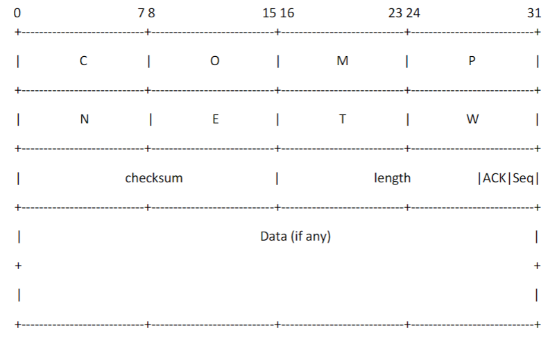

# rdt3.0
Use UDP implement rdt3.0

Use python implement the services on both the sender and receiver ends.

Packet format: The first 8 bytes always contain the value “COMPNETW”. The 9th and 10th bytes together are for the checksum of our packet. For the 11th and 12th bytes, the first 14 bits are used to save the length (header + data) of the current packet, the 15th bit is used to indicate if this packet is an ACK packet, and the 16th bit saves the sequence number of this packet.

